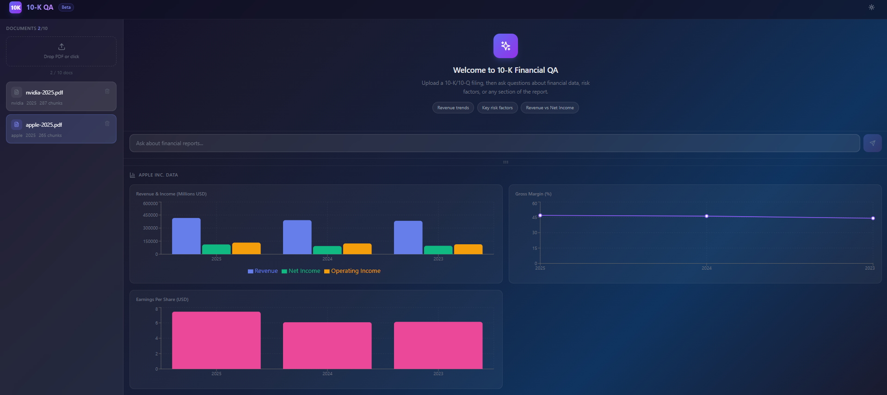
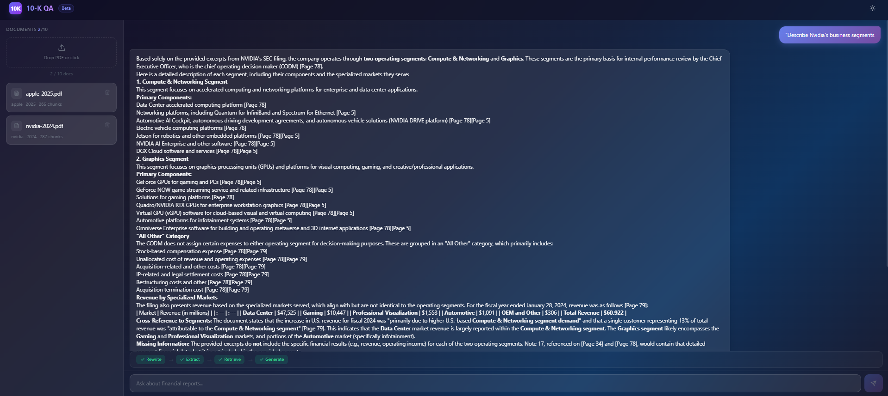
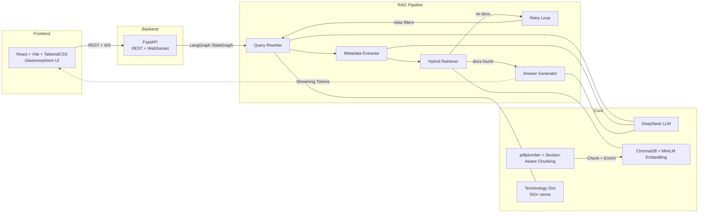

# 10-K Financial QA System

An intelligent SEC financial document Q&A system powered by RAG (Retrieval-Augmented Generation). Upload 10-K/10-Q PDF filings, ask questions in natural language, and get cited answers with cross-company comparison, auto chart generation, and financial ratio calculation.

[中文文档](README_CN.md)

## Screenshots

<div align="center">

**UI Overview**


**Risk Factor Analysis**


**Business Segment Analysis**


**Cross-Company Comparison**


**Financial Ratio Calculation**


</div>

## Architecture



## RAG Pipeline

The core is a 4-node LangGraph `StateGraph` with conditional retry routing:

```
START → query_rewriter → metadata_extractor → retriever ──→ route_after_retrieval
                                                              │
                                                    docs found? → answer_generator → END
                                                    no docs + retries left? → increment_retry → query_rewriter
```

### Node 1: Query Rewriter (`nodes/query_rewriter.py`)

Two-stage expansion before LLM rewriting:

1. **Terminology Expansion** (deterministic, no LLM call): Matches user query against a 550+ financial terminology dictionary, automatically appending synonyms, standard forms, and components. For example, a query containing "EPS" is expanded to "Earnings Per Share, net income, weighted average shares".
2. **LLM Rewriting** (DeepSeek): Expands abbreviations into full terms, adds financial context (units, synonyms), translates Chinese queries to English. For ratio-type questions, explicitly includes calculation components (e.g., ROC → "net income, total equity, total debt, invested capital").

### Node 2: Metadata Extractor (`nodes/metadata_extractor.py`)

LLM extracts structured metadata from the question:

- **company_names** (list): Supports multi-company queries like "Compare Apple and NVIDIA's revenue"
- **year**: Fiscal year filter
- **quarter**: Quarter filter (Q1-Q4, empty for annual queries)

Company names are normalized via a configurable alias mapping (`config.py: COMPANY_ALIASES`), e.g., `aapl → apple`, `googl → google`.

### Node 3: Hybrid Retriever (`nodes/retriever.py`)

Receives metadata from Node 2 (company_names, year, quarter) as ChromaDB `where` filters across all retrieval steps:

**Step 1 — Main Hybrid Search (Vector + BM25 Reranking)**

Over-recalls `TOP_K × HYBRID_CANDIDATE_MULTIPLIER` (30) candidates via ChromaDB vector similarity, then reranks using weighted fusion:

```
final_score = α × normalized_vector_similarity + (1 - α) × normalized_BM25_score
```

- Vector scores (cosine distance) converted to similarity, then Min-Max normalized to [0, 1]
- BM25 scores computed via `rank_bm25.BM25Okapi` with word-boundary tokenization
- `HYBRID_ALPHA = 0.7` (configurable): Favors semantic similarity while incorporating keyword matching
- Returns `TOP_K = 10` documents after reranking
- Multi-company queries: Retrieves per company (splitting retrieval budget evenly) then merges and reranks
- On retry: Progressively relaxes filters — first removes `quarter`, then removes `year`

**Step 2 — Financial Statement Supplemental Retrieval**

When the query contains financial keywords (revenue, margin, EPS, ROE, etc.), additionally retrieves from `item_8_financials` section — pulling up to 5 financial statement chunks to supplement precise figures that semantic search may miss.

**Step 3 — Risk Section Supplemental Retrieval**

When the query contains risk-related keywords (risk, threat, regulation, supply chain, etc.), additionally retrieves from `item_1a_risk` and `item_7_mda` sections, up to 5 chunks each, also reranked via hybrid scoring.

**Step 4 — Deduplication**

Supplemental retrieval results are deduplicated by `page_no` to avoid feeding duplicate content from the same page to the answer generator.

### Conditional Routing (`edges/route_after_retrieval.py`)

```python
if has results → answer_generator
elif retry_count < MAX_RETRIES (2) → query_rewriter (via increment_retry)
else → answer_generator (empty docs → LLM responds "no relevant information found")
```

### Node 4: Answer Generator (`nodes/answer_generator.py`)

- Receives all retrieved documents, formatted with `[Page X] (section, type)` annotations
- Prompt enforces document-only answering: "answer based ONLY on provided documents"
- Generates citations (page number, section, chunk type, summary) for source tracing
- **Auto chart extraction**: An additional non-streaming LLM call determines whether the Q&A involves multi-point financial data; if so, extracts structured chart JSON (chart_type, series, data points) for frontend rendering

## PDF Parsing & Chunking (`core/document_parser.py`)

### 10-K Section-Aware Chunking

1. **Section boundary detection**: Each page's text is matched against 16 regex patterns (`config.py: SECTION_PATTERNS`) to identify SEC Item 1 ~ Item 16 headings. A page-section mapping is built so each chunk inherits its section metadata.

2. **Text splitting**: Paragraphs are the preferred split unit. Paragraphs exceeding `CHUNK_MAX_CHARS` (2000) fall back to sentence-level splitting. `CHUNK_OVERLAP` (200 chars) preserves context from the end of the previous chunk.

3. **Table preservation**: Tables extracted by pdfplumber are kept as **whole chunks** (never split). Tables are formatted as `Header: Value | Header: Value` row-wise text. Tables below `TABLE_MIN_CHARS` (30) are discarded.

4. **Per-page error isolation**: Each page is wrapped in try-catch. On table extraction failure, degrades to text-only extraction. Pages are never skipped entirely.

5. **Metadata extraction**: Company name and year are first extracted from the filename via regex (e.g., `apple-2025.pdf`), falling back to first-page text analysis.

### Chunk Metadata Structure

Each chunk carries metadata used for filtering and citation:

```python
{
    "doc_id": "uuid",
    "company_name": "apple",
    "year": "2025",
    "quarter": "",
    "page_no": 42,
    "section": "item_8_financials",   # 10-K section identifier
    "chunk_type": "text" | "table",   # for citation display
    "chunk_index": 127,
    "detected_terms": "eps,..."       # terminology enrichment info
}
```

## Financial Terminology Dictionary (`core/terminology.py`)

`data/terminology.json` contains 550+ financial terms, providing **dual-side enhancement**:

**Query side** (`expand_query`): Before LLM rewriting, matches terms in the query and appends standard forms, synonyms, and components. Ensures "EPS" can match chunks containing "earnings per share" or "net income per share".

**Chunk side** (`enrich_chunk_text`): During document ingestion, matches terms in chunks and appends synonym/component info before embedding. For example, a chunk containing "EPS" gets embedded with extra context "Earnings Per Share, Syn: net income per share, Comp: net income, weighted average shares" — significantly improving semantic matching for abbreviations.

**Matching engine**: Uses merged regex patterns (multi-word phrases via literal matching, single words via word boundary assertions) for O(n) matching against the full dictionary — no per-term iteration needed.

## Vector Store (`core/vector_store.py`)

ChromaDB embedded mode:

- **Batch ingestion**: Inserts in batches of `VECTOR_STORE_BATCH_SIZE` (100) to avoid memory spikes with large documents
- **Metadata filtering**: Builds ChromaDB `where` clauses from `{company_name, year, quarter, section}` combinations
- **Singleton pattern**: `vector_store` is a module-level singleton shared across requests

## WebSocket Protocol (`/api/chat/ws`)

Client sends: `{"type": "question", "question": "..."}`

Server streams:
1. `{"type": "step", "node": "query_rewriter", "status": "started"}` — when each node begins
2. `{"type": "step", "node": "...", "status": "completed", "data": {...}}` — when node completes, with step data
3. `{"type": "token", "content": "..."}` — during LLM generation
4. `{"type": "done", "answer": "...", "citations": [...], "chart_data": {...}|null, "workflow_steps": [...]}`

## API Endpoints

| Method | Path | Description |
|--------|------|-------------|
| `POST` | `/api/documents/upload` | Upload PDF, parse, chunk, embed, and store |
| `GET` | `/api/documents` | List uploaded documents |
| `DELETE` | `/api/documents/{doc_id}` | Delete document and its vector store data |
| `POST` | `/api/chat` | Synchronous Q&A |
| `WebSocket` | `/api/chat/ws` | Streaming Q&A (pipeline steps + token push) |
| `GET` | `/api/financial-data/{doc_id}` | Extract structured financial metrics |
| `GET` | `/api/health` | Health check |

## Configuration (`backend/config.py`)

All parameters are centrally managed:

| Parameter | Default | Description |
|-----------|---------|-------------|
| `LLM_MODEL` | `deepseek-chat` | LLM model name |
| `EMBEDDING_MODEL` | `all-MiniLM-L6-v2` | 384-dim sentence transformer |
| `TOP_K` | 10 | Number of documents to return after reranking |
| `MAX_RETRIES` | 2 | Max retrieval retry attempts |
| `HYBRID_ALPHA` | 0.7 | Vector vs BM25 weight (0=pure BM25, 1=pure vector) |
| `HYBRID_CANDIDATE_MULTIPLIER` | 3 | Over-recall multiplier |
| `CHUNK_MAX_CHARS` | 2000 | Max characters per text chunk |
| `CHUNK_OVERLAP` | 200 | Overlap characters between chunks |
| `VECTOR_STORE_BATCH_SIZE` | 100 | Ingestion batch size |
| `TERMINOLOGY_ENRICH_CHUNKS` | `True` | Enable chunk-side terminology enrichment |
| `TERMINOLOGY_EXPAND_QUERIES` | `True` | Enable query-side terminology expansion |

## Project Structure

```
backend/
├── config.py              # All configuration constants
├── main.py                # FastAPI entry + CORS
├── core/
│   ├── llm.py             # DeepSeek LLM wrapper (streaming + non-streaming)
│   ├── embeddings.py      # all-MiniLM-L6-v2 embedding model
│   ├── vector_store.py    # ChromaDB + metadata filtering + batch ingestion
│   ├── document_parser.py # pdfplumber + 10-K section-aware chunking
│   ├── state.py           # RAGState TypedDict (shared pipeline state)
│   ├── prompts.py         # All prompt templates
│   └── terminology.py     # 550+ terminology dict (query expansion + chunk enrichment)
├── nodes/                 # LangGraph node functions
│   ├── query_rewriter.py  # Terminology expansion + LLM rewriting
│   ├── metadata_extractor.py # Company/year/quarter extraction
│   ├── retriever.py       # Hybrid search + supplemental retrieval + dedup
│   └── answer_generator.py # Answer + citations + chart extraction
├── edges/
│   └── route_after_retrieval.py # Conditional retry routing
├── workflows/
│   └── rag_pipeline.py    # StateGraph assembly + compilation
├── services/              # Business logic layer
├── routers/               # FastAPI endpoints (documents, chat, financial_data)
├── data/
│   └── terminology.json   # 550+ financial terminology dictionary
└── tests/

frontend/                  # React + Vite + TailwindCSS + Recharts
├── src/
│   ├── hooks/             # useChat (WebSocket), useDocuments
│   ├── components/        # ChatPanel, FinancialCharts, DocumentSidebar, etc.
│   ├── api/               # Axios client + WebSocket factory
│   └── index.css          # Glassmorphism styles
└── vite.config.js         # Dev proxy → localhost:8000
```

## Quick Start

### Prerequisites

- Python 3.10+
- Node.js 18+
- DeepSeek API Key

### 1. Configuration

```bash
# Create .env at project root
echo "DEEPSEEK_API_KEY=sk-xxxxxxxxxxxxxxxx" > .env
```

Get your API key at [platform.deepseek.com](https://platform.deepseek.com/).

### 2. Start Backend

```bash
cd backend
pip install -r requirements.txt
uvicorn main:app --reload --port 8000
```

### 3. Start Frontend

```bash
cd frontend
npm install
npm run dev
```

### 4. Usage

1. Open http://localhost:5173
2. Upload a PDF filing on the left sidebar (filename should contain company name and year, e.g., `apple-2025.pdf`)
3. Ask questions in the chat box (supports English and Chinese)

### Example Questions

- "What are Apple's key risk factors?"
- "Describe NVIDIA's business segments"
- "Compare Apple and NVIDIA's revenue"
- "Calculate Apple's gross margin and net margin for 2025"

## RAGAS Evaluation

Systematic pipeline evaluation using RAGAS (v0.4+), see `backend/eval_ragas.ipynb`. Metrics:

- **Faithfulness** — Is the answer grounded only in retrieved documents? (Validates the no-hallucination-checker design)
- **Context Precision** — Are retrieved documents relevant? (Validates the Top-10 without grading approach)
- **Context Recall** — Were all relevant documents retrieved? (Validates terminology-enhanced retrieval)
- **Answer Relevancy** — Does the answer address the question? (Validates query rewriting)

## Testing

```bash
cd backend
pytest tests/ -v
```

## License

MIT
