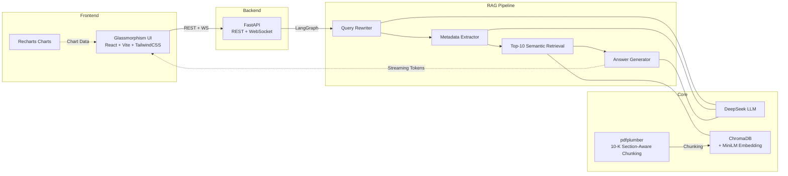

# 10-K Financial QA System

A RAG (Retrieval-Augmented Generation) powered SEC financial report Q&A system. Upload 10-K/10-Q PDF filings and ask questions in natural language — supports cross-company comparison, auto chart generation, and financial ratio calculation.

[中文文档](README_CN.md)

## Screenshots

<div align="center">

**UI Overview**


**Risk Factor Analysis**


**Business Segment Analysis**


**Cross-Company Comparison**


**Financial Ratio Calculation**


</div>

## Architecture



**Core Components**:

| Component | Stack | Description |
|-----------|-------|-------------|
| Frontend | React + Vite + TailwindCSS + Recharts | Glassmorphism UI, dark/light mode, resizable chart panel |
| Backend | FastAPI + WebSocket | REST API + streaming responses, asyncio.to_thread for async processing |
| RAG Pipeline | LangGraph (StateGraph) | 4-node directed graph + conditional retry routing, multi-company retrieval |
| LLM | DeepSeek API | OpenAI-compatible interface |
| Embedding | all-MiniLM-L6-v2 | 384-dim, CPU-friendly |
| Vector Store | ChromaDB | Embedded local storage with metadata filtering |
| PDF Parser | pdfplumber | 10-K section identification + table extraction + per-page error isolation |

## Features

- **Intelligent Q&A** — Answers questions based on uploaded 10-K documents with automatic [Page X] citation
- **Cross-Company Comparison** — Supports multi-company queries (e.g. "Compare Apple and NVIDIA's revenue"), retrieves separately then merges
- **Auto Chart Generation** — Comparison/trend questions automatically generate interactive Recharts charts
- **Financial Ratio Calculation** — Auto-calculates gross margin, net margin, etc. with formula derivation
- **10-K Section-Aware Chunking** — Regex-based SEC Item boundary detection, financial tables preserved as whole chunks
- **Real-Time Streaming** — WebSocket token push with 4-step pipeline status visualization
- **Glassmorphism UI** — Frosted glass effects, gradients, dark/light mode toggle

## LangGraph RAG Pipeline

```
User Question
  → Query Rewriting (expand financial terms: ROC → return on invested capital, net income, equity...)
  → Metadata Extraction (multi-company names, year, quarter)
  → Top-10 Semantic Retrieval (ChromaDB + metadata filtering + Item 8 financials supplemental retrieval)
  → Conditional Routing (no results → relax filters & retry / results found → generate answer)
  → Cited Answer Generation (streaming output + [Page X] citations + auto charts)
```

## Quick Start

### Prerequisites

- Python 3.10+
- Node.js 18+
- DeepSeek API Key

### 1. Configuration

```bash
# Create .env in project root
echo "DEEPSEEK_API_KEY=sk-xxxxxxxxxxxxxxxx" > .env
```

Get your API Key at [platform.deepseek.com](https://platform.deepseek.com/).

### 2. Start Backend

```bash
cd backend
pip install -r requirements.txt
uvicorn main:app --reload --port 8000
```

### 3. Start Frontend

```bash
cd frontend
npm install
npm run dev
```

### 4. Usage

1. Open http://localhost:5173
2. Upload PDF filings on the left sidebar (filename should contain company name and year, e.g. `apple-2025.pdf`)
3. Click to select a document → financial charts appear at the bottom (drag to resize)
4. Ask questions in the chat box (supports both English and Chinese)

### Example Questions

- "What are Apple's key risk factors?"
- "Describe NVIDIA's business segments"
- "Compare Apple and NVIDIA's revenue"
- "Calculate Apple's gross margin and net margin for 2025"

## API Endpoints

| Method | Path | Description |
|--------|------|-------------|
| `POST` | `/api/documents/upload` | Upload PDF filing |
| `GET` | `/api/documents` | List uploaded documents |
| `DELETE` | `/api/documents/{doc_id}` | Delete a document |
| `WebSocket` | `/api/chat/ws` | Streaming Q&A (pipeline steps + token push) |
| `GET` | `/api/financial-data/{doc_id}` | Extract structured financial metrics |

## Project Structure

```
backend/
├── config.py              # Config (10-K section regex, company aliases, retrieval params)
├── main.py                # FastAPI entry + CORS
├── core/                  # Core components
│   ├── llm.py             # DeepSeek LLM wrapper
│   ├── embeddings.py      # all-MiniLM-L6-v2 embedding
│   ├── vector_store.py    # ChromaDB CRUD + filtering (batch ingestion)
│   ├── document_parser.py # pdfplumber + 10-K section-aware chunking + per-page error isolation
│   ├── state.py           # LangGraph RAGState (multi-company support)
│   ├── prompts.py         # Prompt templates (with financial term expansion)
│   └── terminology.py     # Financial terminology dictionary (query expansion + chunk enrichment)
├── nodes/                 # LangGraph 4 nodes
├── edges/                 # Conditional routing
├── workflows/             # StateGraph assembly
├── services/              # Business logic layer
├── routers/               # API endpoints
└── tests/                 # Tests

frontend/
├── src/
│   ├── hooks/             # useChat (WebSocket) / useDocuments
│   ├── components/        # ChatPanel / ChatMessage / FinancialCharts / WorkflowStatus ...
│   ├── pages/             # DashboardPage
│   ├── api/               # Axios + WebSocket client
│   └── index.css          # Glassmorphism styles
└── vite.config.js         # Vite config + API proxy
```

## Testing

```bash
cd backend
pytest tests/ -v
```

## License

MIT
