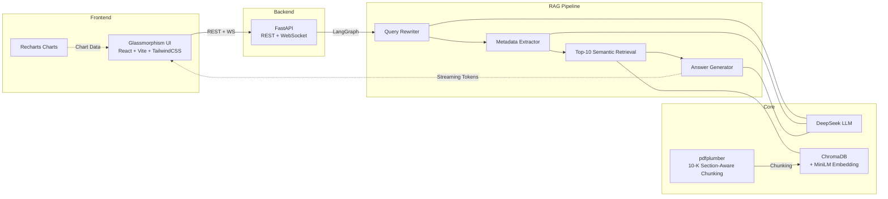

# 10-K Financial QA System

基于 RAG（检索增强生成）的 SEC 财报智能问答系统。用户上传 10-K/10-Q PDF，即可通过自然语言对财报内容进行智能问答，支持跨公司对比、自动图表生成与财务比率计算。

[English](README.md)

## Screenshots

<div align="center">

**UI Overview**


**Risk Factor Analysis**


**Business Segment Analysis**


**Cross-Company Comparison**


**Financial Ratio Calculation**


</div>

## 技术架构



**核心组件**:

| 组件 | 技术选型 | 说明 |
|------|---------|------|
| 前端 | React + Vite + TailwindCSS + Recharts | Glassmorphism UI，暗色/亮色模式，可拖动图表面板 |
| 后端 | FastAPI + WebSocket | REST API + 流式响应，asyncio.to_thread 异步处理 |
| RAG 管道 | LangGraph (StateGraph) | 4 节点有向图 + 条件重试路由，支持多公司检索 |
| LLM | DeepSeek API | OpenAI 兼容接口 |
| Embedding | all-MiniLM-L6-v2 | 384 维，CPU 友好 |
| 向量库 | ChromaDB | 嵌入式本地存储，元数据过滤 |
| PDF 解析 | pdfplumber | 10-K Section 识别 + 表格提取 + 分页容错 |

## Features

- **智能问答** — 基于上传的 10-K 文档回答问题，自动标注 [Page X] 引用来源
- **跨公司对比** — 支持跨公司查询（如 "Compare Apple and NVIDIA's revenue"），分别检索后合并
- **自动图表生成** — 对比/趋势类问题自动生成 Recharts 交互图表
- **财务比率计算** — 自动计算毛利率、净利率等指标，附带公式推导
- **10-K Section 感知切分** — 按正则识别 SEC Item 边界，财务表格整表保留
- **实时流式输出** — WebSocket token 推送，4 步 pipeline 状态可视化
- **Glassmorphism UI** — 毛玻璃效果、渐变色、暗色/亮色模式切换

## LangGraph RAG 管道

```
用户问题
  → 查询改写（展开财务术语: ROC → return on invested capital, net income, equity...）
  → 元数据提取（多公司名、年份、季度）
  → Top-10 语义检索（ChromaDB + 元数据过滤 + Item 8 财务报表补充检索）
  → 条件路由（无结果 → 放宽条件重试 / 有结果 → 生成答案）
  → 带引用答案生成（流式输出 + [Page X] 引用标注 + 自动图表）
```

## 快速开始

### 环境要求

- Python 3.10+
- Node.js 18+
- DeepSeek API Key

### 1. 配置

```bash
# 在项目根目录创建 .env
echo "DEEPSEEK_API_KEY=sk-xxxxxxxxxxxxxxxx" > .env
```

在 [platform.deepseek.com](https://platform.deepseek.com/) 注册获取 API Key。

### 2. 启动后端

```bash
cd backend
pip install -r requirements.txt
uvicorn main:app --reload --port 8000
```

### 3. 启动前端

```bash
cd frontend
npm install
npm run dev
```

### 4. 使用

1. 打开 http://localhost:5173
2. 左侧上传 PDF 财报（文件名含公司名和年份，如 `apple-2025.pdf`）
3. 点击选中文档 → 底部显示财务图表（可拖动调整高度）
4. 在聊天框提问（支持中英文）

### Example Questions

- "What are Apple's key risk factors?"
- "Describe NVIDIA's business segments"
- "Compare Apple and NVIDIA's revenue"
- "Calculate Apple's gross margin and net margin for 2025"

## API 接口

| 方法 | 路径 | 说明 |
|------|------|------|
| `POST` | `/api/documents/upload` | 上传 PDF 财报 |
| `GET` | `/api/documents` | 列出已上传文档 |
| `DELETE` | `/api/documents/{doc_id}` | 删除文档 |
| `WebSocket` | `/api/chat/ws` | 流式问答（pipeline 步骤 + Token 推送） |
| `GET` | `/api/financial-data/{doc_id}` | 提取结构化财务指标 |

## 项目结构

```
backend/
├── config.py              # 配置（10-K Section 正则、公司名映射、检索参数）
├── main.py                # FastAPI 入口 + CORS
├── core/                  # 核心组件
│   ├── llm.py             # DeepSeek LLM 封装
│   ├── embeddings.py      # all-MiniLM-L6-v2 embedding
│   ├── vector_store.py    # ChromaDB 增删查过滤（批量入库）
│   ├── document_parser.py # pdfplumber + 10-K 结构感知切分 + 分页容错
│   ├── state.py           # LangGraph RAGState（支持多公司）
│   ├── prompts.py         # Prompt 模板（含财务术语展开）
│   └── terminology.py     # 金融术语词典（查询扩展 + chunk 增强）
├── nodes/                 # LangGraph 4 节点
├── edges/                 # 条件路由
├── workflows/             # StateGraph 组装
├── services/              # 业务逻辑层
├── routers/               # API 端点
└── tests/                 # 测试

frontend/
├── src/
│   ├── hooks/             # useChat (WebSocket) / useDocuments
│   ├── components/        # ChatPanel / ChatMessage / FinancialCharts / WorkflowStatus ...
│   ├── pages/             # DashboardPage
│   ├── api/               # Axios + WebSocket 客户端
│   └── index.css          # Glassmorphism 样式
└── vite.config.js         # Vite 配置 + API 代理
```

## 测试

```bash
cd backend
pytest tests/ -v
```

## License

MIT
