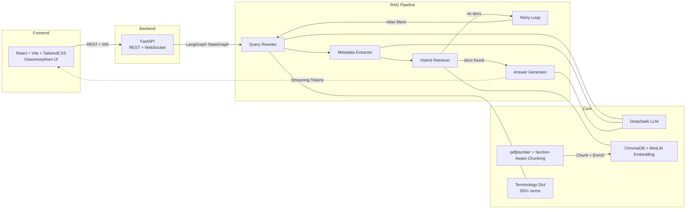

# 10-K Financial QA System

基于 RAG（检索增强生成）的 SEC 财报智能问答系统。用户上传 10-K/10-Q PDF，即可通过自然语言对财报内容进行智能问答，支持跨公司对比、自动图表生成与财务比率计算。

[English](README.md)

## Screenshots

<div align="center">

**UI Overview**


**Risk Factor Analysis**


**Business Segment Analysis**


**Cross-Company Comparison**


**Financial Ratio Calculation**


</div>

## 技术架构



## RAG 管道详解

核心是一个 4 节点 LangGraph `StateGraph`，带条件重试路由：

```
START → query_rewriter → metadata_extractor → retriever ──→ route_after_retrieval
                                                              │
                                                    有文档? → answer_generator → END
                                                    无文档 + 重试次数未满? → increment_retry → query_rewriter
```

### 节点 1：查询改写（`nodes/query_rewriter.py`）

LLM 改写前先做两阶段扩展：

1. **术语扩展**（确定性，不调用 LLM）：将用户查询与 550+ 条金融术语词典匹配，自动追加同义词、标准形式和组成部分。例如查询中包含 "EPS"，会自动扩展为 "Earnings Per Share, net income, weighted average shares"。
2. **LLM 改写**（DeepSeek）：将缩写展开为完整术语、添加金融上下文（单位、同义词），中文查询翻译为英文。对于比率类问题，显式包含计算所需的组成部分（如 ROC → "net income, total equity, total debt, invested capital"）。

### 节点 2：元数据提取（`nodes/metadata_extractor.py`）

LLM 从问题中提取结构化元数据：

- **company_names**（列表）：支持多公司查询，如 "Compare Apple and NVIDIA's revenue"
- **year**：财年过滤
- **quarter**：季度过滤（Q1-Q4，年度查询为空）

公司名通过可配置的别名映射表（`config.py: COMPANY_ALIASES`）标准化，如 `aapl → apple`、`googl → google`。

### 节点 3：混合检索器（`nodes/retriever.py`）

接收 Node 2 提取的元数据（company_names, year, quarter），作为 ChromaDB `where` 过滤条件贯穿所有检索步骤：

**Step 1 — 主混合搜索（向量 + BM25 重排序）**

先通过 ChromaDB 向量相似度召回 `TOP_K × HYBRID_CANDIDATE_MULTIPLIER`（30）个候选文档，再用加权融合重排序：

```
final_score = α × 归一化向量相似度 + (1 - α) × 归一化BM25分数
```

- 向量分数（余弦距离）转换为相似度后做 Min-Max 归一化到 [0, 1]
- BM25 分数通过 `rank_bm25.BM25Okapi` 计算，按词边界分词
- `HYBRID_ALPHA = 0.7`（可配置）：偏向语义相似度但融入关键词匹配
- 重排序后返回 `TOP_K = 10` 个文档
- 多公司查询：按公司分别召回（均分检索预算）再合并重排序
- 重试时（条件路由回退）：逐步放宽过滤条件——第 1 次去掉 `quarter`，第 2 次去掉 `year`

**Step 2 — 财务报表补充检索**

当查询包含财务关键词（revenue, margin, EPS, ROE 等）时，额外直接检索 `item_8_financials` 区块——拉取最多 5 个财务报表 chunk，补充语义搜索可能遗漏的精确数值。

**Step 3 — 风险章节补充检索**

当查询包含风险相关关键词（risk, threat, regulation, supply chain 等）时，额外检索 `item_1a_risk` 和 `item_7_mda` 区块，各最多 5 个 chunk，同样经过混合重排序。

**Step 4 — 去重**

补充检索结果按 `page_no` 去重，避免同一页内容重复输入答案生成器。

### 条件路由（`edges/route_after_retrieval.py`）

```python
if 有检索结果 → answer_generator
elif retry_count < MAX_RETRIES (2) → query_rewriter（经 increment_retry）
else → answer_generator（空文档 → LLM 回答"未找到相关信息"）
```

### 节点 4：答案生成（`nodes/answer_generator.py`）

- 接收所有检索到的文档，格式化为 `[Page X] (section, type)` 标注
- Prompt 强制要求仅基于文档回答："answer based ONLY on provided documents"
- 生成引用（页码、章节、chunk 类型、摘要）用于溯源
- **自动图表提取**：额外的非流式 LLM 调用判断 Q&A 是否涉及多点财务数据，若是则提取结构化图表 JSON（chart_type, series, data points）供前端渲染

## PDF 解析与切分（`core/document_parser.py`）

### 10-K Section 感知切分

1. **章节边界检测**：每页文本与 16 个正则模式（`config.py: SECTION_PATTERNS`）匹配，识别 SEC Item 1 ~ Item 16 标题。构建页码-章节映射，使每个 chunk 继承所属章节元数据。

2. **文本切分**：以段落为首选分割单位。段落超过 `CHUNK_MAX_CHARS`（2000）时退化为句子级分割。`CHUNK_OVERLAP`（200 字符）保留前一个 chunk 末尾的上下文。

3. **表格保留**：pdfplumber 提取的表格作为**整块 chunk** 保留（不切分）。表格格式化为 `Header: Value | Header: Value` 行式文本。低于 `TABLE_MIN_CHARS`（30）的小表格被丢弃。

4. **分页容错**：每页包裹在 try-catch 中。表格提取失败时降级为纯文本提取。页面不会被完全跳过。

5. **元数据提取**：公司名和年份优先从文件名正则提取（如 `apple-2025.pdf`），失败时从首页文本分析。

### Chunk 元数据结构

每个 chunk 携带用于过滤和引用的元数据：

```python
{
    "doc_id": "uuid",
    "company_name": "apple",
    "year": "2025",
    "quarter": "",
    "page_no": 42,
    "section": "item_8_financials",   # 10-K 章节标识
    "chunk_type": "text" | "table",   # 用于引用显示
    "chunk_index": 127,
    "detected_terms": "eps,..."       # 术语增强信息
}
```

## 金融术语词典（`core/terminology.py`）

`data/terminology.json` 中包含 550+ 条金融术语，提供**双侧增强**：

**查询侧**（`expand_query`）：LLM 改写前，匹配查询中的术语并追加标准形式、同义词和组成部分。确保 "EPS" 能匹配到包含 "earnings per share" 或 "net income per share" 的 chunk。

**Chunk 侧**（`enrich_chunk_text`）：文档入库时，匹配 chunk 中的术语并追加同义词/组件信息后再做 embedding。例如包含 "EPS" 的 chunk 会嵌入额外上下文 "Earnings Per Share, Syn: net income per share, Comp: net income, weighted average shares"——大幅提升缩写词的语义匹配效果。

**匹配引擎**：使用合并正则模式（多词短语用字面匹配、单词用词边界断言），对完整词典做 O(n) 匹配——无需逐条迭代。

## 向量存储（`core/vector_store.py`）

ChromaDB 嵌入模式：

- **批量入库**：以 `VECTOR_STORE_BATCH_SIZE`（100）为一批插入，避免大文档导致内存尖峰
- **元数据过滤**：从 `{company_name, year, quarter, section}` 组合构建 ChromaDB `where` 子句
- **单例模式**：`vector_store` 是模块级单例，跨请求共享

## WebSocket 协议（`/api/chat/ws`）

客户端发送：`{"type": "question", "question": "..."}`

服务端流式推送：
1. `{"type": "step", "node": "query_rewriter", "status": "started"}` — 每个节点开始时
2. `{"type": "step", "node": "...", "status": "completed", "data": {...}}` — 节点完成，附带步骤数据
3. `{"type": "token", "content": "..."}` — LLM 生成 token
4. `{"type": "done", "answer": "...", "citations": [...], "chart_data": {...}|null, "workflow_steps": [...]}`

## API 接口

| 方法 | 路径 | 说明 |
|------|------|------|
| `POST` | `/api/documents/upload` | 上传 PDF，解析、切分、嵌入、存储 |
| `GET` | `/api/documents` | 列出已上传文档 |
| `DELETE` | `/api/documents/{doc_id}` | 删除文档及向量存储数据 |
| `POST` | `/api/chat` | 同步问答 |
| `WebSocket` | `/api/chat/ws` | 流式问答（pipeline 步骤 + Token 推送） |
| `GET` | `/api/financial-data/{doc_id}` | 提取结构化财务指标 |
| `GET` | `/api/health` | 健康检查 |

## 配置参数（`backend/config.py`）

所有参数集中管理：

| 参数 | 默认值 | 说明 |
|------|--------|------|
| `LLM_MODEL` | `deepseek-chat` | LLM 模型名 |
| `EMBEDDING_MODEL` | `all-MiniLM-L6-v2` | 384 维 sentence transformer |
| `TOP_K` | 10 | 重排序后返回的文档数 |
| `MAX_RETRIES` | 2 | 最大检索重试次数 |
| `HYBRID_ALPHA` | 0.7 | 向量与 BM25 权重（0=纯 BM25，1=纯向量） |
| `HYBRID_CANDIDATE_MULTIPLIER` | 3 | 过召回倍数 |
| `CHUNK_MAX_CHARS` | 2000 | 文本 chunk 最大字符数 |
| `CHUNK_OVERLAP` | 200 | chunk 间重叠字符数 |
| `VECTOR_STORE_BATCH_SIZE` | 100 | 入库批次大小 |
| `TERMINOLOGY_ENRICH_CHUNKS` | `True` | 启用 chunk 侧术语增强 |
| `TERMINOLOGY_EXPAND_QUERIES` | `True` | 启用查询侧术语扩展 |

## 项目结构

```
backend/
├── config.py              # 所有配置常量
├── main.py                # FastAPI 入口 + CORS
├── core/
│   ├── llm.py             # DeepSeek LLM 封装（流式 + 非流式）
│   ├── embeddings.py      # all-MiniLM-L6-v2 嵌入模型
│   ├── vector_store.py    # ChromaDB + 元数据过滤 + 批量入库
│   ├── document_parser.py # pdfplumber + 10-K 结构感知切分
│   ├── state.py           # RAGState TypedDict（管道共享状态）
│   ├── prompts.py         # 所有 Prompt 模板
│   └── terminology.py     # 550+ 术语词典（查询扩展 + chunk 增强）
├── nodes/                 # LangGraph 节点函数
│   ├── query_rewriter.py  # 术语扩展 + LLM 改写
│   ├── metadata_extractor.py # 公司/年份/季度提取
│   ├── retriever.py       # 混合搜索 + 补充检索 + 去重
│   └── answer_generator.py # 答案 + 引用 + 图表提取
├── edges/
│   └── route_after_retrieval.py # 条件重试路由
├── workflows/
│   └── rag_pipeline.py    # StateGraph 组装 + 编译
├── services/              # 业务逻辑层
├── routers/               # FastAPI 端点（documents, chat, financial_data）
├── data/
│   └── terminology.json   # 550+ 金融术语词典
└── tests/

frontend/                  # React + Vite + TailwindCSS + Recharts
├── src/
│   ├── hooks/             # useChat (WebSocket), useDocuments
│   ├── components/        # ChatPanel, FinancialCharts, DocumentSidebar 等
│   ├── api/               # Axios 客户端 + WebSocket 工厂
│   └── index.css          # Glassmorphism 样式
└── vite.config.js         # 开发代理 → localhost:8000
```

## 快速开始

### 环境要求

- Python 3.10+
- Node.js 18+
- DeepSeek API Key

### 1. 配置

```bash
# 在项目根目录创建 .env
echo "DEEPSEEK_API_KEY=sk-xxxxxxxxxxxxxxxx" > .env
```

在 [platform.deepseek.com](https://platform.deepseek.com/) 注册获取 API Key。

### 2. 启动后端

```bash
cd backend
pip install -r requirements.txt
uvicorn main:app --reload --port 8000
```

### 3. 启动前端

```bash
cd frontend
npm install
npm run dev
```

### 4. 使用

1. 打开 http://localhost:5173
2. 左侧上传 PDF 财报（文件名含公司名和年份，如 `apple-2025.pdf`）
3. 在聊天框提问（支持中英文）

### 示例问题

- "What are Apple's key risk factors?"
- "Describe NVIDIA's business segments"
- "Compare Apple and NVIDIA's revenue"
- "Calculate Apple's gross margin and net margin for 2025"

## RAGAS 评估

使用 RAGAS（v0.4+）进行系统性管道评估，见 `backend/eval_ragas.ipynb`。评估指标：

- **Faithfulness** — 答案是否仅基于检索文档（验证无幻觉检查器的设计）
- **Context Precision** — 检索文档的相关性（验证 Top-10 无评分策略）
- **Context Recall** — 是否检索到所有相关文档（验证术语增强检索）
- **Answer Relevancy** — 答案是否切题（验证查询改写）

## 测试

```bash
cd backend
pytest tests/ -v
```

## License

MIT
